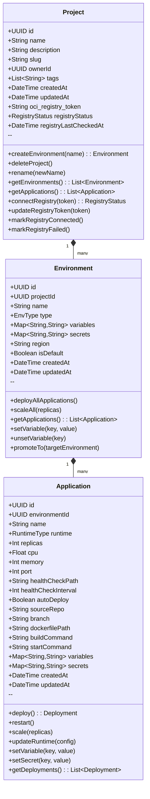

```mermaid
classDiagram

    class Project {
        +UUID id
        +String name
        +String description
        +String slug
        +UUID ownerId
        +List~String~ tags
        +DateTime createdAt
        +DateTime updatedAt
        +String oci_registry_token
        +RegistryStatus registryStatus
        +DateTime registryLastCheckedAt
        --
        +createEnvironment(name): Environment
        +deleteProject()
        +rename(newName)
        +getEnvironments(): List~Environment~
        +getApplications(): List~Application~
        +connectRegistry(token): RegistryStatus
        +updateRegistryToken(token)
        +markRegistryConnected()
        +markRegistryFailed()
    }

    class Environment {
        +UUID id
        +UUID projectId
        +String name
        +EnvType type
        +Map~String,String~ variables
        +Map~String,String~ secrets
        +String region
        +Boolean isDefault
        +DateTime createdAt
        +DateTime updatedAt
        --
        +deployAllApplications()
        +scaleAll(replicas)
        +getApplications(): List~Application~
        +setVariable(key, value)
        +unsetVariable(key)
        +promoteTo(targetEnvironment)
    }

    class Application {
        +UUID id
        +UUID environmentId
        +String name
        +RuntimeType runtime
        +Int replicas
        +Float cpu
        +Int memory
        +Int port
        +String healthCheckPath
        +Int healthCheckInterval
        +Boolean autoDeploy
        +String sourceRepo
        +String branch
        +String dockerfilePath
        +String buildCommand
        +String startCommand
        +Map~String,String~ variables
        +Map~String,String~ secrets
        +DateTime createdAt
        +DateTime updatedAt
        --
        +deploy(): Deployment
        +restart()
        +scale(replicas)
        +updateRuntime(config)
        +setVariable(key, value)
        +setSecret(key, value)
        +getDeployments(): List~Deployment~
    }

    Project "1" *-- "many" Environment
    Environment "1" *-- "many" Application

```